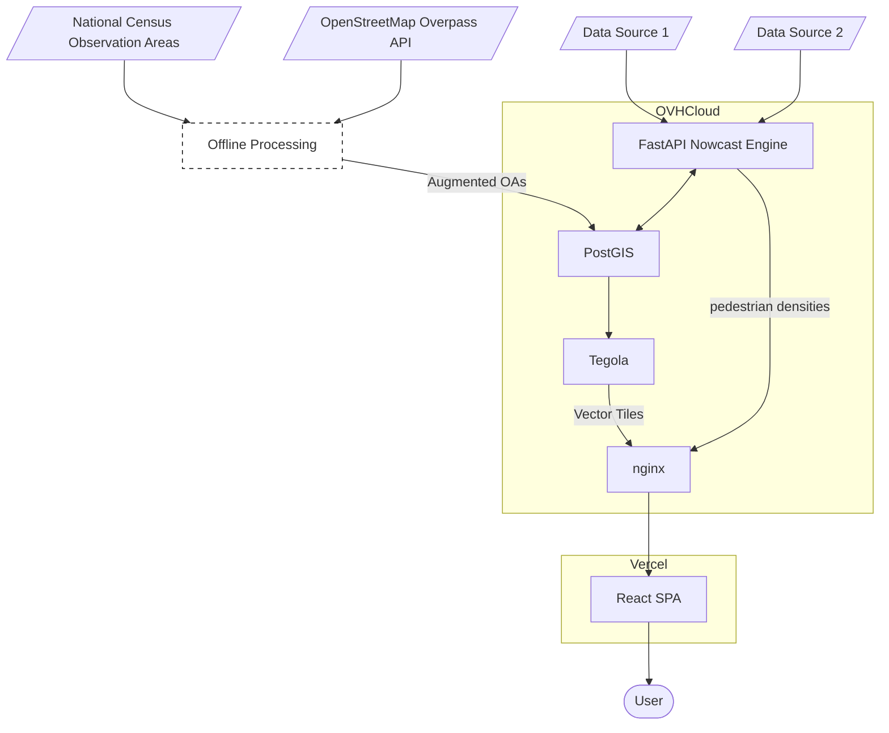

# Edinburgh Crowds Backend (Private Repo)

This repository contains the backend for the Edinburgh Crowds project.
The backend is four separate docker containers started using a single docker-compose.yml:
- PostGIS (a database)
- Tegola (a tile server)
- The Engine (a FastAPI app that performs business logic)
- Nginx (a proxy that serves Tegola on /tiles and the Engine on /engine)

Note that https certificates are intended to be managed using certbot, so the docker-compose.yml mounts them from /etc/letsencrypt

This server is currently run on an incredibly cheap and low-quality VPS provided by OVHCloud: 1 vCPU, 2 GB RAM, 20 GB disk.

## Architecture


## Repository structure
Edinburgh Crowds is implemented in three GitHub repositories:
- [edicrowds-frontend](https://github.com/TristanGoss/edicrowds-frontend) (a public GPLv3 licenced repository)
- [edicrowds-backend](https://github.com/TristanGoss/edicrowds-backend) (a public GPLv3 licenced repository)
- [edicrowds-backend-private](https://github.com/TristanGoss/edicrowds-backend-private) (a private repository, this repository)

edicrowds-backend is almost exactly the same as edicrowds-backend-private (and the two are kept synchronised). The difference is that edicrowds-backend does not contain the nowcasting engine (which we retain as a trade secret). Instead, if cloned and run, edicrowds-backend will return a dummy nowcast.

## CI/CD and Deployment
In order to keep initial cloud costs down, Edinburgh Crowds does not use any artefact registries or CI/CD, although we plan to add these eventually. Instead, we require linting and unit testing via pre-commit hooks, and (for the backend) clone the repository onto the deployment target. From there, docker-compose handles the rest (apart from ssl certificate registration, which is manual). For the frontend, we let Vercel scan the edicrowds-frontend repo and pull in deployments as needed.

## Tileserver
Tegola generates and buffers vector tiles from PostGIS, and serves them to the frontend. These tiles provide the edges of the National Census Observation Areas.

## PostGIS

### To connect to PostGIS from container
```bash
sudo docker exec -it postgis psql -U admin -d geodb
```
